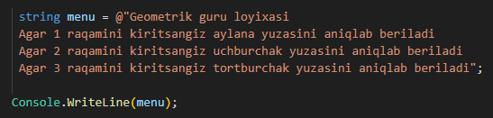
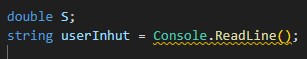
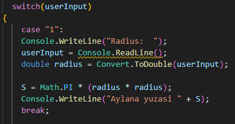
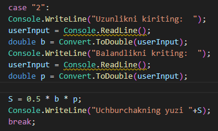
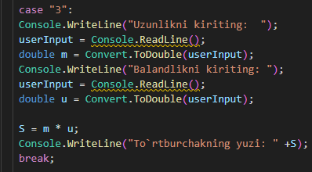
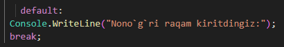

# GeometryGuru

>>***Ushbu dastur orqali uch turdagi geometrik shakllarni yuzasini aniqlashingiz mumkin***
  
  1. aylananing yuzasni
  1. uchburchakning yuzasini
  3. tortburchakning yuzasini

# Birinchi qism

# Ikkinchi qism

#  ***switch*** (aylanani yuzasini aniqlash uchun ishlatilgan logika ***case 1***)

#  ***switch*** (uchburchakni yuzasini aniqlash uchun ishlatilgan logika ***case 2***)

#  ***switch*** (tortburchakning yuzasini aniqlash uchun ishlatilgan logika ***case 3***)

***switch*** (***default:***)

# Demo

